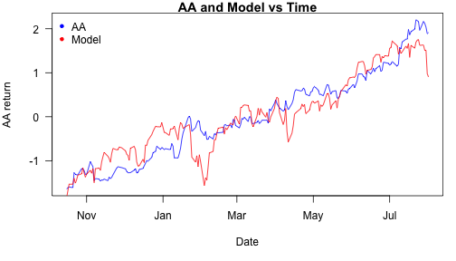
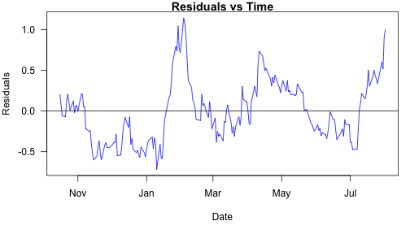

## ............................................................................


<h1>Stock Explorer</h1>
<h4>An application for exploring stock and market relationships</h4>

--- .class #id 
## Stock Explorer - What is it?

* A simple application that allows you to explore a stock's relationship with its market benchmark (e.g AA vs SP500).  
* Parameters used:  Stock ticker, End Date, and Duration.
* Application features:
  * Linear regression: <b><i>stock = b0 + b1 * market</i></b>
  * R-squared calculation
  * Plots of: 1) stock return and the model over time; and, 2) residuals over time
* Example:  http://cpeachlbnl.shinyapps.io/CourseProject/
* Code repository:  https://github.com/cpeachLBNL/DDP_CourseProject

--- .class #id 

## Stock Explorer - How does it work?
* The application fits a linear regression to stock data as a function of market data.
* For example, given:  stock ticker = AA, end date = 2014/08/01, and duration = 200, <b><i>Stock Explorer</i></b> determines a model and R-squared of:


```r
    lm1 <- lm(stock ~ market, data=stockData)
    B0 <- round(coef(lm1)[1], 2); B1 <- round(coef(lm1)[2], 2)
    stockData$predStock <- B0 + B1 * stockData$market
    print(paste("Model: stock =", B0, "+", B1, "x market"))
```

```
## [1] "Model: stock = 0 + 0.92 x market"
```

```r
    stockData$resid = resid(lm1)
    paste("R-squared=", round(summary(lm1)$r.squared,2))
```

```
## [1] "R-squared= 0.85"
```

--- .class #id 

## Stock Explorer - Can it plot?
* <b><i>Stock Explorer</i></b> plots stock returns and the model predictions over time.


```r
    par(mar=c(5,4,1,1), las=1)
    plot(stockData$date, stockData$stock, type="l", col="blue", main=paste(ticker, "and Model vs Time"),
         xlab="Date", ylab=paste(ticker, "return"), 
         ylim=range(stockData$stock, stockData$predStockReturn))
    lines(stockData$date, stockData$predStock, lwd=1, col="red")
    legend("topleft", legend = c(ticker,"Model"), col=c("blue", "red"), pch = 20, bty="n")
```

 


--- .class #id 
## Stock Explorer - How about residuals?
* Residuals are automatically calulated and plotted over time.


```r
    par(mar=c(5,4,1,1), las=1)
    plot(stockData$date, stockData$resid, type="l", col="blue", main="Residuals vs Time", xlab="Date", ylab="Residuals")
        abline(h = 0, lwd = 1) #Horizontal line through 0
```

 
